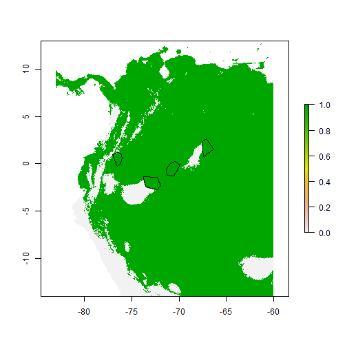
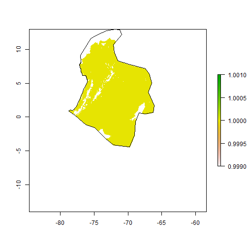
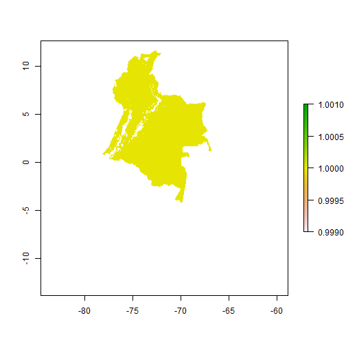

Este es un ejemplo de procesamiento manual de los aportes recibidos en la modelatón de primates usando datos ingresados en la versión 2 de BioModelos. Los archivos relevantes a este procesamiento estan en la carpeta Z:/Modelos/2016/31102016

###Cargar librerias

```r
#knitr::opts_chunk$set(echo = FALSE)
library(raster)
library(rgdal)
#Función para leer archivos geojson
geojson2shp<-function(infile){
  shp<-readOGR(infile,"OGRGeoJSON",verbose=FALSE)
  return(shp)
}
```

###Cargar archivos del procesamiento

```r
sp.raster<-raster("Z:/Modelos/2016/31102016/Alouatta_seniculus_0_mx.tif") 
sp.shp<-geojson2shp("Z:/Modelos/2016/31102016/aportes/192_Alouatta_seniculus_03112016_6_umbral0.geojson")
poly2<-readOGR("Z:/Modelos/2016/31102016/aportes","Alouatta_seniculus_add_HO")
```

```
## OGR data source with driver: ESRI Shapefile 
## Source: "Z:/Modelos/2016/31102016/aportes", layer: "Alouatta_seniculus_add_HO"
## with 1 features
## It has 1 fields
```

El modelo escogido en la modelatón para *Alouatta seniculus* corresponde al umbral 0



Los aportes consisten de


```r
sp.shp@data
```

```
##           action
## 0      Intersect
## 1            Cut
## 2  Agregar área
## 3  Agregar área
## 4  Agregar área
## 5  Agregar área
## 6  Agregar área
## 7  Agregar área
## 8  Agregar área
## 9  Agregar área
## 10 Agregar área
## 11 Agregar área
## 12 Agregar área
## 13           Add
## 14     Intersect
## 15     Intersect
```

Por un error en la interfaz de BioModelos v2, la interpretación de los valores Intersect, corresponde a áreas para añadir al modelo, Add, corresponde a áreas para eliminar del modelo y Cut, corresponde a áreas para recorte por polígono.

Adicionalmente, el shapefile poly2 consiste de un polígono que se agregó en el laboratorio para completar el ejercicio realizado por los expertos. Primero vamos a agregar esas áreas al modelo:


```r
polyAdd<-rasterize(sp.shp[c(1,15,16),],sp.raster,field=1) 
polyAdd2<-rasterize(poly2,sp.raster,field=1) 
sp.raster[Which(polyAdd==1)]<-1
sp.raster[Which(polyAdd2==1)]<-1
plot(sp.raster)
plot(sp.shp[c(1,15,16),],add=T)
plot(poly2,add=T)
```



Ahora eliminamos un área de sobrepredicción en La Guajira

```r
polyCut<-rasterize(sp.shp[14,],sp.raster,field=1) #poligono que se elimina del modelo
sp.raster[Which(polyCut==1&!(is.na(sp.raster)))]<-0
plot(sp.raster)
plot(sp.shp[14,], add=T)
```



Luego, recortamos por el poligono de extensión de ocurrencia

```r
polyEoo<-rasterize(sp.shp[2,],sp.raster,field=1) #poligono que se elimina del modelo
sp.raster<-sp.raster*polyEoo
sp.raster[Which(sp.raster==0)]<-NA
plot(sp.raster)
plot(sp.shp[2,], add=T)
```


Finalmente, recortamos por el área continental de Colombia y obtenemos el mapa consenso final para *Alouatta seniculus*


```r
col<-raster("Z:/Modelos/Zamias/maskColombia.tif")
sp.raster<-sp.raster*col
plot(sp.raster)
```


Por último se guardan los resultados `writeRaster(sp.raster, "./Consenso/Alouatta_seniculus.tif")`


